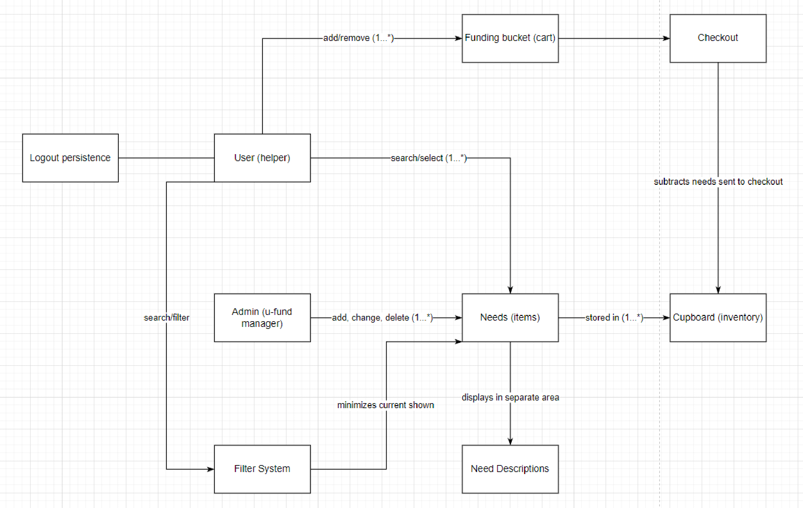
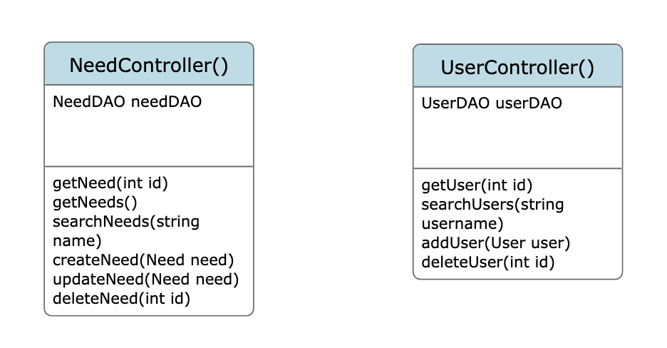
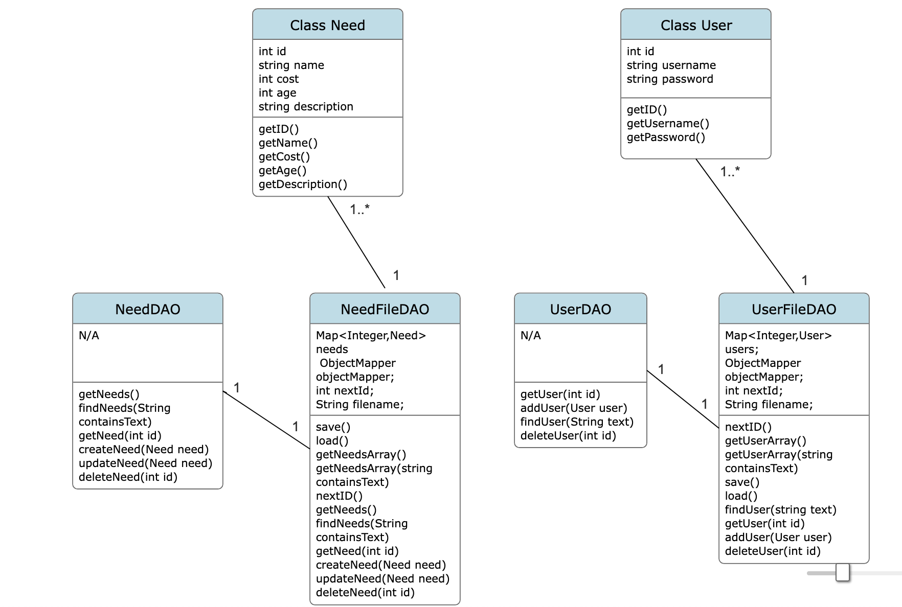
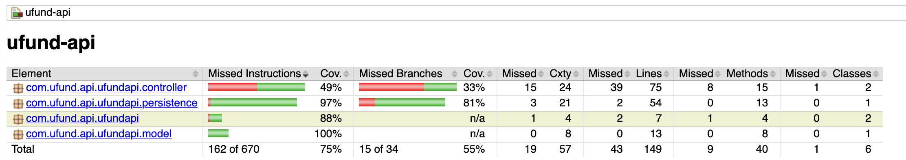

# PROJECT Design Documentation

> _The following template provides the headings for your Design
> Documentation.  As you edit each section make sure you remove these
> commentary 'blockquotes'; the lines that start with a > character
> and appear in the generated PDF in italics but do so only **after** all team members agree that the requirements for that section and current Sprint have been met. **Do not** delete future Sprint expectations._

## Team Information
* Team name: Trees
* Team members
  * Nick Farsaci
  * Ryan Noyes
  * Zach Herring
  * Devin Rhodie

## Executive Summary

This project contains a web application that supports a charitable organization that helps donate and plant trees. A user on this site would log on, and find a selection of young trees that they can fund to be planted. They would have access to a funding basket, where they can select and insert tree(s) of their liking to fund. A user can also sort the trees by name, age, or cost on the page that contains the list of trees. Users, upon clicking a tree, can also view a detailed description of the tree. An administrator of the site, upon logging in, can view that same list of trees. They have the ability to add, remove, and modify the current visible list of trees. They do not have access to the funding basket. If they wish, they also can 'view' the website as a user.

### Purpose
>  _**[Sprint 2 & 4]** Provide a very brief statement about the project and the most
> important user group and user goals._

The purpose of this project is to build a website that can support a charitable organization that helps donate and plant trees.

User Group - People who enjoy nature, or people who wish to support charitable organizations
User goal - Help better environment, plant trees

### Glossary and Acronyms
> _**[Sprint 2 & 4]** Provide a table of terms and acronyms._

| Term | Definition |
|------|------------|
| SPA | Single Page |

## Requirements

This section describes the features of the application.

> _In this section you do not need to be exhaustive and list every
> story.  Focus on top-level features from the Vision document and
> maybe Epics and critical Stories._

### Definition of MVP
> _**[Sprint 2 & 4]** Provide a simple description of the Minimum Viable Product._

Sprint 2: The MVP, as of right now, consists of a basic web application that pulls from a list of needs managed by an administrator. The default URL leads to a login page, where upon log-in, will either show a user-view or an admin view. From this view, a user is able to view a list of needs contained within a database (within a json file). From there, they are able to add their desired needs to a cart, where they can proceed to checkout from there. If the admin-view is accessed, there will not be access to a funding basket. Instead, the admin will be able to view the needs and then modify the needs that are visible (add/delete/modify).

### MVP Features
>  _**[Sprint 4]** Provide a list of top-level Epics and/or Stories of the MVP._

### Enhancements
> _**[Sprint 4]** Describe what enhancements you have implemented for the project._

## Application Domain

This section describes the application domain.

> _**[Sprint 2 & 4]** Provide a high-level overview of the domain for this application. You
> can discuss the more important domain entities and their relationship
> to each other._

Sprint 2: As of right now, the application has a model, controller and persistence tiers. Inside the model, there is a generic need class that contains basic information about the need: id, name, cost, and description. This interacts with the NeedFileDAO, as well as the NeedDAO. The needDAO is an interface in which has all the basic calls for the need class, which then the actual implementation is within the needFileDAO. These are both within the persistence folder. The controller folder has a needController, which deals with the actual API calls and responses. There is also a need basket controller, which is to manage the need basket for the 'user' (similar to the need controller), as well as a funding basket DAO which implements the basic functions of the funding basket.

## Architecture and Design

This section describes the application architecture.

### Summary

The following Tiers/Layers model shows a high-level view of the webapp's architecture. 
**NOTE**: detailed diagrams are required in later sections of this document.
> _**[Sprint 1]** (Augment this diagram with your **own** rendition and representations of sample system classes, placing them into the appropriate M/V/VM (orange rectangle) tier section. Focus on what is currently required to support **Sprint 1 - Demo requirements**. Make sure to describe your design choices in the corresponding _**Tier Section**_ and also in the _**OO Design Principles**_ section below.)_

 (in directory)

The web application, is built using the Model–View–ViewModel (MVVM) architecture pattern. 

The Model stores the application data objects including any functionality to provide persistance. 

The View is the client-side SPA built with Angular utilizing HTML, CSS and TypeScript. The ViewModel provides RESTful APIs to the client (View) as well as any logic required to manipulate the data objects from the Model.

Both the ViewModel and Model are built using Java and Spring Framework. Details of the components within these tiers are supplied below.

### Overview of User Interface

This section describes the web interface flow; this is how the user views and interacts with the web application.

> _Provide a summary of the application's user interface.  Describe, from the user's perspective, the flow of the pages in the web application._

Sprint 3: As of sprint 3, the default page a user will ecounter is the login page. Depending on how the user logs in (admin/user), they will be shown slightly different pages. The user will be shown a list of needs, and when clicked on, a short description of the need will be displayed to the side of the list. The user will have the option to add needs to their funding basket, which then can be viewed on a different page. Alternatively, the admin will not have the ability to add or view the cart. Instead, they will have the opportunity to see the user view, as well as the option to modify the visible list of needs (add/delete/modify). 

### View Tier
> _**[Sprint 4]** Provide a summary of the View Tier UI of your architecture.
> Describe the types of components in the tier and describe their
> responsibilities.  This should be a narrative description, i.e. it has
> a flow or "story line" that the reader can follow._

> _**[Sprint 4]** You must  provide at least **2 sequence diagrams** as is relevant to a particular aspects 
> of the design that you are describing.  (**For example**, in a shopping experience application you might create a 
> sequence diagram of a customer searching for an item and adding to their cart.)
> As these can span multiple tiers, be sure to include an relevant HTTP requests from the client-side to the server-side 
> to help illustrate the end-to-end flow._

> _**[Sprint 4]** To adequately show your system, you will need to present the **class diagrams** where relevant in your design. Some additional tips:_
 >* _Class diagrams only apply to the **ViewModel** and **Model** Tier_
>* _A single class diagram of the entire system will not be effective. You may start with one, but will be need to break it down into smaller sections to account for requirements of each of the Tier static models below._
 >* _Correct labeling of relationships with proper notation for the relationship type, multiplicities, and navigation information will be important._
 >* _Include other details such as attributes and method signatures that you think are needed to support the level of detail in your discussion._

### ViewModel Tier
> _**[Sprint 1]** List the classes supporting this tier and provide a description of there purpose._
Controller/Need Controller - Class that sends out the API request, and returns HTTP status' and Need objects
Controller/UserController - CLass that sends out API requests regarding user information, and returns HTTP status'

> _**[Sprint 4]** Provide a summary of this tier of your architecture. This
> section will follow the same instructions that are given for the View
> Tier above._

> _At appropriate places as part of this narrative provide **one** or more updated and **properly labeled**
> static models (UML class diagrams) with some details such as critical attributes and methods._
> 

### Model Tier
> _**[Sprint 1]** List the classes supporting this tier and provide a description of there purpose._

Model/Need class - Handles data attributed to a need (Name, cost, id, description) as well as a few helper functions to get these values\
Persistence/NeedDAO - Public interface that defines the API functions\
Persistence/NeedDAOFile - Class that reads/writes to the JSON file (storage/inventory), and performs functions on it when the API is called\

> _**[Sprint 2, 3 & 4]** Provide a summary of this tier of your architecture. This
> section will follow the same instructions that are given for the View
> Tier above._

Model/Need class - Handles data attributed to a need (Name, cost, id, age, description) as well as a few helper functions to get these values\
Model/User class- Handles data attributed to a User, as well as a few helper functions to get these values\
Persistence/NeedDAO - Public interface that defines the API functions dealing with Needs\
Persistence/NeedDAOFile - Class that reads/writes to the need JSON file (storage/inventory), and performs functions on it when the API is called\
Persistence/UserDAO - Public interface that defines the API functions dealing with Users\
Persistence UserFileDAO - Class that reads/writes to the user JSON file (storage/inventory), and performs functions on it when the API is called\

> _At appropriate places as part of this narrative provide **one** or more updated and **properly labeled**
> static models (UML class diagrams) with some details such as critical attributes and methods._
> 
 (in directory)

## OO Design Principles

> _**[Sprint 1]** Name and describe the initial OO Principles that your team has considered in support of your design (and implementation) for this first Sprint._
Since the scope of the project is quite small at the moment, we were mainly thinking about Single Responsibility and how each class has it's own "job". In further sprints, we plan to add more from SOLID and other principles.

> _**[Sprint 2, 3 & 4]** Will eventually address upto **4 key OO Principles** in your final design. Follow guidance in augmenting those completed in previous Sprints as indicated to you by instructor. Be sure to include any diagrams (or clearly refer to ones elsewhere in your Tier sections above) to support your claims._

Sprint 3: We have elaborated on single responsibility, but we have also addressed dependency inversion by using several kinds of DAOs and FileDAOs with needs and users to handle API calls which are then handled in Angular with other classes designed around single responsibility. The DAOs also follow the Open/Closed principle, with the fileDAOs inheriting from their individual DAOs.

> _**[Sprint 3 & 4]** OO Design Principles should span across **all tiers.**_

## Static Code Analysis/Future Design Improvements
> _**[Sprint 4]** With the results from the Static Code Analysis exercise, 
> **Identify 3-4** areas within your code that have been flagged by the Static Code 
> Analysis Tool (SonarQube) and provide your analysis and recommendations.  
> Include any relevant screenshot(s) with each area._

1. Needing to change names of certain classes so that 
   they match other classes and the naming conventions are consistent throughout the project.
   .png)

2. Needing to change some test classes to not public because they do not need to be delcared as so.
   .png)

3. Changing a variable type from var to const so that there are no potential scope issues.
   .png)

4. Empty CSS files. To complete this issue, styles will be added into the CSS file.
   .png)

> _**[Sprint 4]** Discuss **future** refactoring and other design improvements your team would explore if the team had additional time._

## Testing
> _This section will provide information about the testing performed
> and the results of the testing._

### Acceptance Testing
> _**[Sprint 2 & 4]** Report on the number of user stories that have passed all their
> acceptance criteria tests, the number that have some acceptance
> criteria tests failing, and the number of user stories that
> have not had any testing yet. Highlight the issues found during
> acceptance testing and if there are any concerns._

Sprint 2: As of right now, we have no stories that are failing their acceptance criteria tests. The only user stories that have not had any testing should be the ones in the product backlog.

### Unit Testing and Code Coverage
> _**[Sprint 4]** Discuss your unit testing strategy. Report on the code coverage
> achieved from unit testing of the code base. Discuss the team's
> coverage targets, why you selected those values, and how well your
> code coverage met your targets._

>_**[Sprint 2 & 4]** **Include images of your code coverage report.** If there are any anomalies, discuss
> those._

Sprint 2: For our code coverage, it seems that our NeedController needs to be tested additonally, as our coverage is under 50%.

## Ongoing Rationale
>_**[Sprint 1, 2, 3 & 4]** Throughout the project, provide a time stamp **(yyyy/mm/dd): Sprint # and description** of any _**mayor**_ team decisions or design milestones/changes and corresponding justification._

Sprint 1: n/a
Sprint 2: n/a
Sprint 3: n/a
